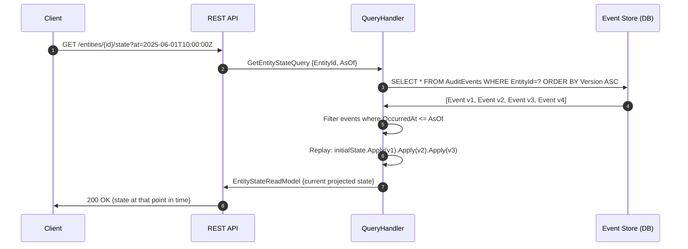
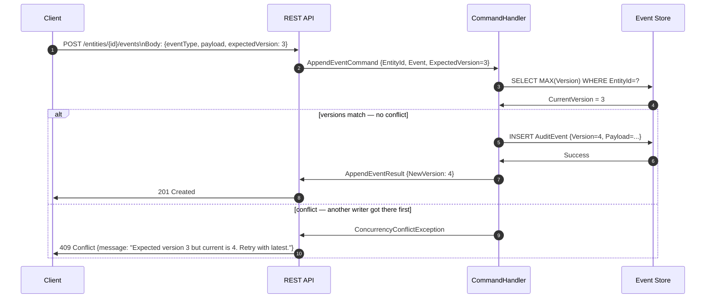

# AuditTrail

> A tamper-evident, event-sourced audit logging microservice built with ASP.NET Core 8, CQRS via MediatR, and an append-only EF Core store. Every state change is stored as an immutable event — entities can be replayed to any point in time.

[](https://dotnet.microsoft.com/)
[](https://learn.microsoft.com/en-us/aspnet/core/)
[](https://github.com/jbogard/MediatR)
[](LICENSE)

---

## Overview

AuditTrail implements **event sourcing** — instead of storing the current state of an entity, it stores every change as an ordered, immutable event. The current state is always a projection of those events replayed in sequence. This makes the audit log inherently tamper-evident: you cannot update or delete history, only append to it.

The API is built with **CQRS (Command Query Responsibility Segregation)** via MediatR: commands append events, queries project state. All writes go through a pipeline with validation and optimistic concurrency, all reads hit a separate read model.

### Key Features

- Append-only event store — no UPDATE or DELETE on event records, ever
- Full event replay — reconstruct any entity's state at any timestamp
- CQRS via MediatR — clean separation of write and read paths
- Optimistic concurrency — version-based conflict detection on writes
- Event versioning — schema evolution without breaking old events
- REST API with full OpenAPI (Swagger) documentation
- xUnit test suite with 90%+ coverage on domain logic

---

## Architecture

### CQRS + Event Sourcing Overview

```
                        CLIENT
                           │
                    REST API request
                           │
              ┌────────────▼────────────┐
              │    ASP.NET Core 8       │
              │    Web API layer        │
              └────────────┬────────────┘
                           │ IMediator.Send()
              ┌────────────▼────────────────────────────────────┐
              │              MediatR Pipeline                    │
              │                                                  │
              │  ┌─────────────────┐    ┌──────────────────────┐│
              │  │  Validation     │    │  Logging behaviour   ││
              │  │  behaviour      │    │  (structured trace)  ││
              │  │  (FluentValid.) │    └──────────────────────┘│
              │  └─────────────────┘                            │
              └────────────┬────────────────────────────────────┘
                           │
           ┌───────────────┴─────────────────┐
           │                                 │
    COMMAND PATH                        QUERY PATH
    (write side)                        (read side)
           │                                 │
  ┌────────▼──────────┐          ┌───────────▼──────────┐
  │  Command Handler  │          │   Query Handler       │
  │                   │          │                       │
  │ 1. Load aggregate │          │ 1. Load all events    │
  │    events from    │          │    for entity         │
  │    event store    │          │ 2. Replay events →    │
  │ 2. Apply domain   │          │    projected state    │
  │    logic          │          │ 3. Return read model  │
  │ 3. Raise new      │          └───────────────────────┘
  │    DomainEvent    │
  │ 4. Check version  │
  │    (optimistic    │
  │    concurrency)   │
  │ 5. Append to      │
  │    event store    │
  └────────┬──────────┘
           │
  ┌────────▼──────────────────────────────────┐
  │           EVENT STORE (EF Core)           │
  │                                           │
  │  AuditEvents table (append-only)          │
  │  ┌──────┬──────────┬──────────┬─────────┐ │
  │  │ Id   │ EntityId │ Version  │ Payload │ │
  │  │ (Guid│ (string) │ (int,    │ (JSON,  │ │
  │  │ PK)  │          │ seq per  │ typed   │ │
  │  │      │          │ entity)  │ event)  │ │
  │  └──────┴──────────┴──────────┴─────────┘ │
  │                                           │
  │  EF Core migration: no Update/Delete      │
  │  SQL constraint: Version is unique per    │
  │  EntityId (prevents concurrent writes)    │
  └───────────────────────────────────────────┘
```

### Event Sourcing — State Reconstruction



### Write Path — Optimistic Concurrency



### Event Schema & Versioning

```
AuditEvent (stored in DB)
├── Id              Guid          Primary key
├── EntityId        string        "User:abc123", "Order:xyz789"
├── EntityType      string        "User", "Order"
├── EventType       string        "UserCreated", "EmailChanged"
├── Version         int           Monotonically increasing per EntityId
├── OccurredAt      DateTimeOffset UTC timestamp
├── OccurredBy      string        Actor who caused the event
├── SchemaVersion   int           For event schema evolution
└── Payload         string        JSON-serialised event body

Example events for User:abc123:
  v1  UserCreated      {name:"Kriti", email:"old@email.com"}  2025-01-01
  v2  EmailChanged     {from:"old@email.com", to:"new@email.com"}  2025-03-15
  v3  RoleAssigned     {role:"Admin", assignedBy:"system"}  2025-04-01

Replay v1→v3 gives current state:
  {name:"Kriti", email:"new@email.com", role:"Admin"}
```

---

## Tech Stack

| Layer | Technology |
|---|---|
| Runtime | .NET 8, ASP.NET Core 8 |
| CQRS | MediatR — IRequest, IRequestHandler, IPipelineBehavior |
| Validation | FluentValidation via MediatR pipeline behaviour |
| Persistence | EF Core 8, SQL Server (append-only, no deletes) |
| Serialisation | System.Text.Json, polymorphic event deserialisation |
| API Docs | Swashbuckle (OpenAPI / Swagger UI) |
| Testing | xUnit, Moq, EF Core InMemory |
| Concurrency | Optimistic locking via Version column + unique constraint |

---

## Project Structure

```
AuditTrail/
├── src/
│   ├── AuditTrail.API/                  # ASP.NET Core entry point
│   │   ├── Controllers/
│   │   │   └── AuditController.cs
│   │   └── Program.cs
│   ├── AuditTrail.Application/          # CQRS — commands, queries, handlers
│   │   ├── Commands/
│   │   │   ├── AppendEventCommand.cs
│   │   │   └── AppendEventCommandHandler.cs
│   │   ├── Queries/
│   │   │   ├── GetEntityStateQuery.cs
│   │   │   ├── GetEntityStateQueryHandler.cs
│   │   │   ├── GetEntityHistoryQuery.cs
│   │   │   └── GetEntityHistoryQueryHandler.cs
│   │   └── Behaviours/
│   │       ├── ValidationBehaviour.cs
│   │       └── LoggingBehaviour.cs
│   ├── AuditTrail.Domain/               # Pure domain — no infra deps
│   │   ├── Events/
│   │   │   ├── AuditEvent.cs
│   │   │   └── DomainEventBase.cs
│   │   ├── Aggregates/
│   │   │   └── EntityAggregate.cs       # Apply() + replay logic
│   │   └── Exceptions/
│   │       └── ConcurrencyConflictException.cs
│   ├── AuditTrail.Infrastructure/       # EF Core, migrations
│   │   ├── Persistence/
│   │   │   ├── AuditDbContext.cs
│   │   │   ├── AuditEventRepository.cs
│   │   │   └── Migrations/
│   │   └── Serialisation/
│   │       └── EventPayloadConverter.cs  # Polymorphic JSON
│   └── AuditTrail.Tests/
│       ├── Unit/
│       │   ├── EntityAggregateTests.cs
│       │   └── AppendEventCommandHandlerTests.cs
│       └── Integration/
│           └── AuditControllerTests.cs   # WebApplicationFactory
├── docker-compose.yml                    # API + SQL Server
└── README.md
```

---

## API Reference

### Append an event

```http
POST /api/audit/{entityId}/events
Content-Type: application/json

{
  "entityType": "User",
  "eventType": "EmailChanged",
  "occurredBy": "admin@company.com",
  "expectedVersion": 2,
  "payload": {
    "from": "old@email.com",
    "to": "new@email.com"
  }
}
```

Response `201 Created`:
```json
{ "newVersion": 3, "eventId": "d3f1a2b4-..." }
```

### Get current state

```http
GET /api/audit/{entityId}/state
GET /api/audit/{entityId}/state?at=2025-03-01T00:00:00Z
```

### Get full history

```http
GET /api/audit/{entityId}/history
GET /api/audit/{entityId}/history?from=2025-01-01&to=2025-06-01
```

---

## Getting Started

```bash
git clone https://github.com/K-riti/AuditTrail.git
cd AuditTrail

# Start API + SQL Server
docker-compose up --build

# Run migrations
dotnet ef database update --project src/AuditTrail.Infrastructure

# Run tests
dotnet test

# Swagger UI
open http://localhost:5000/swagger
```

---

## Why Append-Only?

The EF Core `DbContext` is configured to throw if any `UPDATE` or `DELETE` is attempted on `AuditEvents`:

```csharp
protected override void OnModelCreating(ModelBuilder builder)
{
    builder.Entity<AuditEvent>(e =>
    {
        e.HasKey(x => x.Id);
        // Composite unique — enforces optimistic concurrency at DB level
        e.HasIndex(x => new { x.EntityId, x.Version }).IsUnique();
        // No update/delete — append only enforced at application layer
    });
}
```

---

## License

MIT — see [LICENSE](LICENSE) for details.
